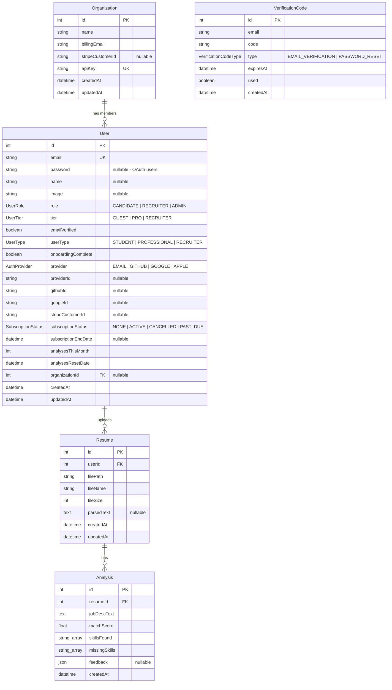

# Skillora — Entity Relationship Diagram

> Auto-generated from `backend/prisma/schema.prisma` — Last updated: February 9, 2026

---

## ERD

---

## Relationships

| Relationship | Type | Description |
|---|---|---|
| Organization → User | One-to-Many | An organization has many member users (Recruiter tier) |
| User → Resume | One-to-Many | A user uploads many resumes (cascade delete) |
| Resume → Analysis | One-to-Many | A resume has many analyses against different job descriptions (cascade delete) |
| VerificationCode | Standalone | Linked by email string (not FK) for email verification and password reset codes |

## Enums

| Enum | Values | Used By |
|------|--------|---------|
| `UserRole` | CANDIDATE, RECRUITER, ADMIN | User.role |
| `UserTier` | GUEST, PRO, RECRUITER | User.tier |
| `SubscriptionStatus` | NONE, ACTIVE, CANCELLED, PAST_DUE | User.subscriptionStatus |
| `AuthProvider` | EMAIL, GITHUB, GOOGLE, APPLE | User.provider |
| `UserType` | STUDENT, PROFESSIONAL, RECRUITER | User.userType |
| `VerificationCodeType` | EMAIL_VERIFICATION, PASSWORD_RESET | VerificationCode.type |

## Indexes

| Table | Index | Purpose |
|-------|-------|---------|
| User | `email` | Fast lookups by email |
| User | `providerId` | Fast OAuth provider lookups |
| Resume | `userId` | Fast user resume listing |
| Analysis | `resumeId` | Fast resume analysis listing |
| VerificationCode | `email, code, type` | Fast code verification lookups |
